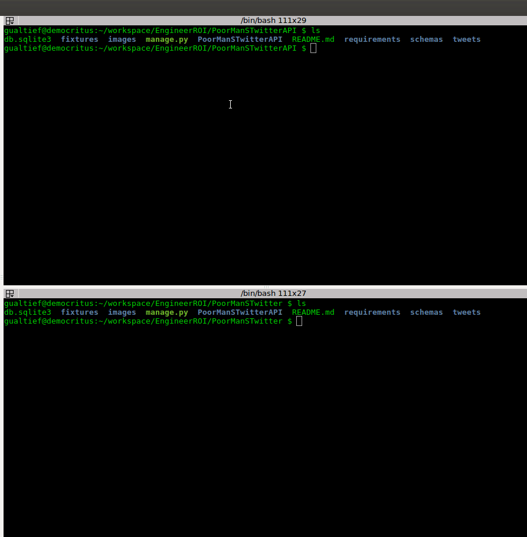

<!-- START doctoc generated TOC please keep comment here to allow auto update -->
<!-- DON'T EDIT THIS SECTION, INSTEAD RE-RUN doctoc TO UPDATE -->
**Table of Contents**

- [Poor Man's Twitter API](#poor-mans-twitter-api)
  - [Overview](#overview)
  - [Running Tests](#running-tests)
  - [Running the App](#running-the-app)

<!-- END doctoc generated TOC please keep comment here to allow auto update -->

# Poor Man's Twitter API

<kbd></kbd>

## Overview

This app follows the requirements outlined in [these requirements](../requirements/OSR Coding Sample Project.pdf).

Consists of a very simple RESTful service, which allows two operations:

- GET all "tweets" (very simple objects, which one containing three fields; name, message, and date time).
- POST a "tweet".

This app is the back-end service for the [Poor Man's Twitter UI](../PoorManSTwitterUI), which has been implemented in Javascript using [Vue.JS](https://vuejs.org/).

## Requirements

This app has been developed using Python 3.6.3 and Django 2.1.1.

On Ubuntu Linux, you may execute the following command on a terminal to install this particular Django version:

    sudo pip3 install "Django~=2.1.1"

## Running Tests

To run all tests, execute the following command-line on a terminal:

    python3 manage.py test -v 2

You should get an output similar to the following:

    Creating test database for alias 'default' ('file:memorydb_default?mode=memory&cache=shared')...
    Operations to perform:
      Synchronize unmigrated apps: corsheaders, messages, rest_framework, staticfiles
      Apply all migrations: admin, auth, contenttypes, sessions, tweets
    Synchronizing apps without migrations:
      Creating tables...
        Running deferred SQL...
    Running migrations:
      Applying contenttypes.0001_initial... OK
      Applying auth.0001_initial... OK
      Applying admin.0001_initial... OK
      Applying admin.0002_logentry_remove_auto_add... OK
      Applying admin.0003_logentry_add_action_flag_choices... OK
      Applying contenttypes.0002_remove_content_type_name... OK
      Applying auth.0002_alter_permission_name_max_length... OK
      Applying auth.0003_alter_user_email_max_length... OK
      Applying auth.0004_alter_user_username_opts... OK
      Applying auth.0005_alter_user_last_login_null... OK
      Applying auth.0006_require_contenttypes_0002... OK
      Applying auth.0007_alter_validators_add_error_messages... OK
      Applying auth.0008_alter_user_username_max_length... OK
      Applying auth.0009_alter_user_last_name_max_length... OK
      Applying sessions.0001_initial... OK
      Applying tweets.0001_initial... OK
    System check identified no issues (0 silenced).
    test_attempt_to_create_a_tweet_missing_message (tweets.tests.TweetViewSetTests) ... ok
    test_attempt_to_create_a_tweet_missing_name (tweets.tests.TweetViewSetTests) ... ok
    test_create_a_tweet (tweets.tests.TweetViewSetTests) ... ok
    test_get_all_tweets (tweets.tests.TweetViewSetTests) ... ok

    ----------------------------------------------------------------------
    Ran 4 tests in 0.084s

    OK
    Destroying test database for alias 'default' ('file:memorydb_default?mode=memory&cache=shared')...

## Running the App

First make sure that migrations are executed:

    python3 manage.py migrate
    
To start the service, execute the following command-line:

    python3 manage.py runserver

Now you will be able to send HTTP requests to the URL path `/tweets`:

To post a tweet:

    curl --header "Content-Type: application/json" \
      --request POST \
      --data '{"message":"Perfect is the enemy of good.","name":"Voltaire"}' \
      http://127.0.0.1:8000/tweets

    curl --header "Content-Type: application/json" \
      --request POST \
      --data "{\"message\":\"I don't want to achieve immortality through my work ... I want to achieve it through not dying.\",\"name\":\"Woody Allen\"}" \
      http://127.0.0.1:8000/tweets

    curl --header "Content-Type: application/json" \
      --request POST \
      --data "{\"message\":\"If I had a dollar for every million-dollar idea I've had, I'd be rich.\",\"name\":\"Greg Meyer\"}" \
      http://127.0.0.1:8000/tweets

To get a list of all tweets:

    curl -H 'Accept: application/json; indent=4' http://127.0.0.1:8000/tweets
