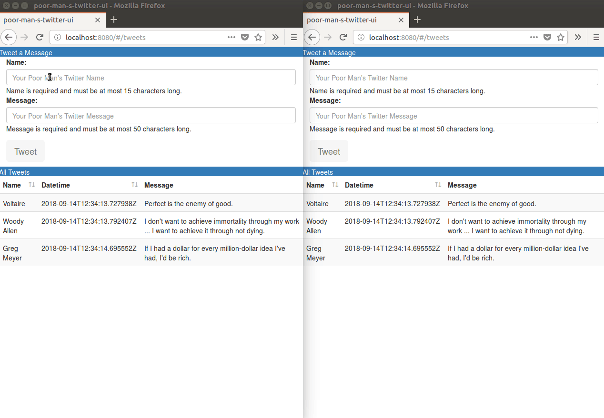

<!-- START doctoc generated TOC please keep comment here to allow auto update -->
<!-- DON'T EDIT THIS SECTION, INSTEAD RE-RUN doctoc TO UPDATE -->
**Table of Contents**

- [Poor Man's Twitter UI](#poor-mans-twitter-ui)
  - [Overview](#overview)
  - [Running Tests](#running-tests)
  - [Running the App](#running-the-app)
  - [Building the App](#building-the-app)

<!-- END doctoc generated TOC please keep comment here to allow auto update -->

# Poor Man's Twitter UI

<kbd></kbd>

## Overview

This app follows the requirements outlined in [these requirements](../requirements/OSR Coding Sample Project.pdf).

Consists of a very simple single-page application, which is comprised of the following components:

- A web form, which a user can use to submit a tweet.
- A non-paginated HTML table, which shows all the tweets submitted so far.

This app is the front-end service for the [Poor Man's Twitter API](../PoorManSTwitterAPI), which has been implemented in Python using [Django](https://www.djangoproject.com/).

## Running Tests

To run [Jasmine tests](https://jasmine.github.io/):

    npm run test

Jasmine specs are available at [test/unit/specs](test/unit/specs).

The command above should output something similar to the following:

    > poor-man-s-twitter-ui@1.0.0 test /home/gualtief/workspace/EngineerROI/PoorManSTwitter/PoorManSTwitterUI
    > karma start test/unit/karma.conf.js --single-run

    12 09 2018 20:04:58.541:INFO [karma]: Karma v1.7.1 server started at http://0.0.0.0:9876/
    12 09 2018 20:04:58.547:INFO [launcher]: Launching browser Chrome with unlimited concurrency
    12 09 2018 20:04:58.558:INFO [launcher]: Starting browser Chrome
    12 09 2018 20:05:02.601:INFO [Chrome 69.0.3497 (Linux 0.0.0)]: Connected on socket CWj1sqjgZRwDJLJAAAAA with id 30161619
    Chrome 69.0.3497 (Linux 0.0.0) ERROR LOG: '[Vue warn]: Cannot find element: #app'
    INFO LOG: 'Download the Vue Devtools extension for a better development experience:
    https://github.com/vuejs/vue-devtools'
    INFO LOG: 'You are running Vue in development mode.
    Make sure to turn on production mode when deploying for production.
    See more tips at https://vuejs.org/guide/deployment.html'

      TweetForm.vue
        ✓ should accept valid parameters
        ✓ should reject invalid name
        ✓ should reject invalid message

    Chrome 69.0.3497 (Linux 0.0.0): Executed 3 of 3 SUCCESS (0.213 secs / 0.315 secs)
    TOTAL: 3 SUCCESS

    =============================== Coverage summary ===============================
    Statements   : 97.6% ( 285/292 )
    Branches     : 56.25% ( 9/16 )
    Functions    : 98.45% ( 254/258 )
    Lines        : 97.59% ( 283/290 )
    ================================================================================

## Running the App

First install all project dependencies:

    npm install

The app itself does not use node.js, which is used by [webpack](https://webpack.js.org/), this project's build automation tool.

To start the service, run the following command-line on a terminal:

    npm run dev

The default port is 8080. You may use a different port by using the following command instead:

    npm run dev -- --port 9090

## Building the App

To build for production with minification:

    npm run build

This command will generate a deployable package under the folder `dist`.
